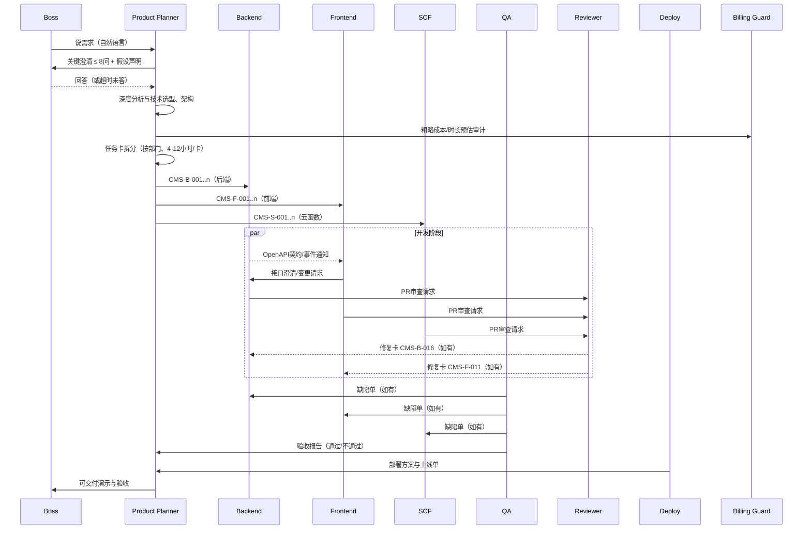
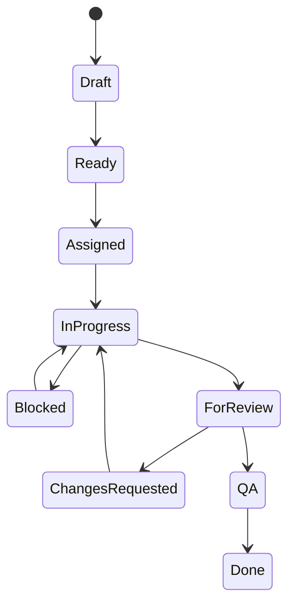

下面是为你的“0基础 AI 协同开发系统”量身设计的一整套方案。我将内容按你建议的 5 个文件组织，覆盖系统架构、Product Planner 详细设计、执行部门设计、Skills 手册大纲以及实施路线图。每个文件都包含设计思路、实现方案（含 JSON Schema / 流程图 / 示例）、风险与应对、最佳实践。你可以直接将这些内容落到你的 skills/ 目录与 orchestrator 中使用。

---

## 文件1：系统架构设计.md（第一部分）

### 1. 设计总览

**目标**：让 0 基础用户像对真实公司说话一样，用自然语言描述目标，系统自动完成澄清、规划、拆分、执行、协作、审查、验收与交付。

**核心理念**：层级化、契约化、标准化、自治化（各部门能“按章思考”，而非“机械执行”）。

#### 1.1 角色与层级

* **Boss（用户）**：只描述业务目标与约束（成本/时间/合规），不关心实现细节。
* **Product Planner（P）**：**唯一默认可主动生成任务卡的上级**。负责澄清→分析→规划→拆分→统筹协作→里程碑与风险管理。
* **执行中层部门**：Backend、Frontend、SCF、QA、Deploy、Billing Guard。

  * 接受并“**认领**”任务卡（不是被动执行）。每个部门都包含：**理解 → 设计 → 实施 → 自测 → 汇报**。
* **Reviewer（特权角色）**：审查所有部门产出；**仅在发现缺陷时**可签发**修复类任务卡**给相关部门。
* **（可选）轻量工作子代理**：用于处理简单/批量化子任务（如编写样板代码、生成单测、脚手架脚本），接受来自中层部门的派发。

> **治理原则**：
>
> * Planner 是“源头任务卡”唯一产出方；
> * Reviewer 是“修复任务卡”唯一产出方；
> * 其余部门不可擅自造卡，只能提出**变更请求（Change Request）**或**澄清请求（Clarification Request）**。

#### 1.2 组织与流程图

**组织结构图（Mermaid）**

```mermaid
graph TD
  Boss[Boss / 0基础用户] --> P[Product Planner]
  P --> B[Backend Dept]
  P --> F[Frontend Dept]
  P --> S[SCF Dept]
  P --> Q[QA Acceptance]
  P --> D[Deploy / Ops]
  P --> BG[Billing Guard]
  P --> R[Reviewer]
  B -.可指派-> L1B[轻量子代理-后端]
  F -.可指派-> L1F[轻量子代理-前端]
  S -.可指派-> L1S[轻量子代理-云函数]
```

**端到端时序（Mermaid）**



---

### 2. 任务卡标准格式（JSON Schema）

**设计原则**

* **契约化**：所有部门按同一份 JSON Schema 沟通，避免语义漂移。
* **可执行**：包含 Prompt 建议、测试准则、依赖、交付物路径等，便于自动化。
* **可治理**：包含预算上限、风险等级、审核门禁（Reviewer/QA Gate）。

**Schema（Draft 2020-12）**

```json
{
  "$schema": "https://json-schema.org/draft/2020-12/schema",
  "$id": "https://example.com/schemas/task-card.json",
  "title": "TaskCard",
  "type": "object",
  "required": [
    "taskId", "projectId", "module", "title", "department",
    "phase", "priority", "estimatedHours", "description",
    "acceptanceCriteria", "deliverables", "createdByRole",
    "status", "reviewPolicy", "qaPolicy"
  ],
  "properties": {
    "taskId": {
      "type": "string",
      "pattern": "^[A-Z0-9\\-]+$",
      "description": "如 CMS-B-001。生成规则：<项目>-<部门首字母>-<流水号>"
    },
    "projectId": { "type": "string", "description": "项目唯一标识，如 CMS" },
    "module": { "type": "string", "description": "功能模块名，如 content-type-builder" },
    "title": { "type": "string" },
    "department": {
      "type": "string",
      "enum": ["Backend", "Frontend", "SCF", "QA", "Deploy", "Reviewer", "BillingGuard"]
    },
    "phase": {
      "type": "string",
      "enum": ["Clarify", "Planning", "MVP", "Beta", "Hardening", "Release"]
    },
    "priority": { "type": "string", "enum": ["P0", "P1", "P2"] },
    "riskLevel": { "type": "string", "enum": ["Low", "Medium", "High"], "default": "Medium" },
    "estimatedHours": { "type": "number", "minimum": 1, "maximum": 16 },
    "dueDate": { "type": "string", "format": "date-time" },
    "dependencies": {
      "type": "array",
      "items": { "type": "string", "pattern": "^[A-Z0-9\\-]+$" },
      "description": "依赖任务卡ID列表"
    },
    "description": { "type": "string", "description": "人读可懂的任务说明" },
    "technicalRequirements": {
      "type": "array",
      "items": { "type": "string" },
      "description": "技术约束/要求要点"
    },
    "apiContract": {
      "type": "object",
      "description": "当部门=Backend/SCF时的接口契约草案或OpenAPI路径",
      "properties": {
        "openapiPath": { "type": "string" },
        "changePolicy": { "type": "string" }
      }
    },
    "dbDesign": {
      "type": "object",
      "description": "数据库表/索引/ER关键点（后端任务可用）",
      "properties": {
        "tables": { "type": "array", "items": { "type": "string" } },
        "indexes": { "type": "array", "items": { "type": "string" } }
      }
    },
    "uiSpecs": {
      "type": "object",
      "description": "当部门=Frontend时的UI描述/原型链接/组件约束",
      "properties": {
        "screens": { "type": "array", "items": { "type": "string" } },
        "designSystem": { "type": "string", "default": "Ant Design" }
      }
    },
    "acceptanceCriteria": {
      "type": "array",
      "items": {
        "type": "object",
        "required": ["id", "statement", "type"],
        "properties": {
          "id": { "type": "string" },
          "type": { "type": "string", "enum": ["Functional", "NonFunctional", "Security"] },
          "statement": { "type": "string", "description": "Given-When-Then 或断言文字" },
          "testHints": { "type": "string", "description": "QA/自动化的测法提示" }
        }
      }
    },
    "deliverables": {
      "type": "array",
      "items": { "type": "string" },
      "description": "提交物，如代码路径、脚本、OpenAPI文件、截图、测试报告"
    },
    "needsCoordination": {
      "type": "array",
      "description": "跨部门协作点",
      "items": {
        "type": "object",
        "required": ["withDept", "topic", "artifact"],
        "properties": {
          "withDept": {
            "type": "string",
            "enum": ["Backend", "Frontend", "SCF", "QA", "Deploy", "Reviewer", "BillingGuard"]
          },
          "topic": { "type": "string" },
          "artifact": { "type": "string", "description": "如OpenAPI路径、UI原型链接" },
          "deadline": { "type": "string", "format": "date-time" }
        }
      }
    },
    "aiPromptSuggestion": {
      "type": "object",
      "required": ["system", "user"],
      "properties": {
        "system": { "type": "string" },
        "user": { "type": "string" },
        "notes": { "type": "string" }
      }
    },
    "assignment": {
      "type": "object",
      "properties": {
        "assigneeRole": { "type": "string" },
        "assigneeModel": { "type": "string", "description": "用于执行的具体模型/子代理名" },
        "toolchain": { "type": "array", "items": { "type": "string" } },
        "env": { "type": "string", "description": "dev/stage/prod" }
      }
    },
    "reviewPolicy": {
      "type": "object",
      "required": ["requiresReviewer"],
      "properties": {
        "requiresReviewer": { "type": "boolean", "default": true },
        "reviewerRole": { "type": "string", "default": "Reviewer" },
        "gates": { "type": "array", "items": { "type": "string" }, "description": "如安全、性能、可维护性" }
      }
    },
    "qaPolicy": {
      "type": "object",
      "required": ["requiresQA"],
      "properties": {
        "requiresQA": { "type": "boolean", "default": true },
        "testDepth": { "type": "string", "enum": ["Smoke", "Regression", "Performance"], "default": "Smoke" },
        "coverageTarget": { "type": "number", "minimum": 0, "maximum": 100, "default": 80 }
      }
    },
    "budget": {
      "type": "object",
      "properties": {
        "estimatedCostUSD": { "type": "number", "minimum": 0 },
        "maxCostUSD": { "type": "number", "minimum": 0 },
        "costGuardTags": { "type": "array", "items": { "type": "string" } }
      }
    },
    "metrics": {
      "type": "object",
      "properties": {
        "successCriteria": { "type": "array", "items": { "type": "string" } },
        "telemetry": { "type": "array", "items": { "type": "string" } }
      }
    },
    "links": {
      "type": "object",
      "properties": {
        "repo": { "type": "string" },
        "branch": { "type": "string" },
        "pr": { "type": "string" },
        "issueTracker": { "type": "string" },
        "docs": { "type": "string" }
      }
    },
    "artifacts": {
      "type": "array",
      "items": {
        "type": "object",
        "required": ["type", "path"],
        "properties": {
          "type": { "type": "string" },
          "path": { "type": "string" },
          "checksum": { "type": "string" }
        }
      }
    },
    "createdByRole": { "type": "string", "enum": ["ProductPlanner", "Reviewer"] },
    "createdAt": { "type": "string", "format": "date-time" },
    "status": {
      "type": "string",
      "enum": ["Draft", "Ready", "Assigned", "InProgress", "Blocked", "ForReview", "ChangesRequested", "QA", "Done"]
    },
    "notes": { "type": "string" },
    "changeHistory": {
      "type": "array",
      "items": {
        "type": "object",
        "required": ["at", "by", "change"],
        "properties": {
          "at": { "type": "string", "format": "date-time" },
          "by": { "type": "string" },
          "change": { "type": "string" }
        }
      }
    }
  }
}
```

**ID 命名与流水**

* `<项目代号>-<部门首字母>-<三位流水>`，如 `CMS-B-001`。
* 部门首字母：B=Backend, F=Frontend, S=SCF, Q=QA, D=Deploy, R=Reviewer（修复卡）, G=BillingGuard（仅审计卡）。

**示例任务卡（Backend）**

```json
{
  "taskId": "CMS-B-001",
  "projectId": "CMS",
  "module": "content-type-builder",
  "title": "建模接口：内容类型 CRUD + 字段校验",
  "department": "Backend",
  "phase": "MVP",
  "priority": "P0",
  "riskLevel": "Medium",
  "estimatedHours": 8,
  "dependencies": [],
  "description": "实现内容类型的创建、读取、更新、删除接口，并支持字段定义（文本、数值、布尔、枚举、引用）与校验规则。",
  "technicalRequirements": [
    "数据库：PostgreSQL + Prisma",
    "API：RESTful + OpenAPI 3.0",
    "鉴权：JWT + RBAC占位"
  ],
  "apiContract": {
    "openapiPath": "openapi/cms-content-type.yaml",
    "changePolicy": "任何Breaking变更必须由Frontend确认并过审"
  },
  "dbDesign": {
    "tables": ["content_types", "content_fields", "migrations"],
    "indexes": ["content_types.slug UNIQUE", "content_fields.type+content_type_id"]
  },
  "acceptanceCriteria": [
    {
      "id": "AC1",
      "type": "Functional",
      "statement": "Given 创建内容类型请求 When 字段定义合法 Then 返回201且写入DB并可查询",
      "testHints": "单测覆盖字段类型与校验规则边界"
    },
    {
      "id": "AC2",
      "type": "Security",
      "statement": "When 未授权请求创建 Then 返回401",
      "testHints": "鉴权中间件UT"
    }
  ],
  "deliverables": [
    "src/api/content-types/*.ts",
    "openapi/cms-content-type.yaml",
    "tests/content-types/*.spec.ts"
  ],
  "needsCoordination": [
    {
      "withDept": "Frontend",
      "topic": "字段组件与校验映射",
      "artifact": "openapi/cms-content-type.yaml"
    }
  ],
  "aiPromptSuggestion": {
    "system": "你是资深Node后端工程师，习惯以TDD开发与OpenAPI先行。",
    "user": "根据OpenAPI文件生成CRUD控制器与Prisma模型，并保证单测覆盖≥80%。"
  },
  "assignment": { "assigneeRole": "Backend", "assigneeModel": "L1B", "toolchain": ["Node18", "Prisma", "Jest"] },
  "reviewPolicy": { "requiresReviewer": true, "gates": ["安全", "规范"] },
  "qaPolicy": { "requiresQA": true, "testDepth": "Regression", "coverageTarget": 80 },
  "budget": { "estimatedCostUSD": 12, "maxCostUSD": 20, "costGuardTags": ["backend-mvp"] },
  "metrics": { "successCriteria": ["接口平均P95<120ms"], "telemetry": ["/content-types/*"] },
  "links": { "repo": "git@repo/cms.git", "branch": "feature/content-type" },
  "artifacts": [],
  "createdByRole": "ProductPlanner",
  "createdAt": "2025-10-30T09:00:00Z",
  "status": "Ready"
}
```

---

### 3. 部门职责边界

**Product Planner**

* 权限：规划、拆分、发卡；协调；里程碑；风险/变更管理。
* 禁止：跳过澄清直接规划（除非使用**默认假设**并记录）。

**Backend**

* 权限：API/数据建模；生成 OpenAPI；服务性能优化。
* 禁止：擅自变更前端代码；未与 Frontend 协商进行 Breaking 改动。

**Frontend**

* 权限：UI/状态管理；对接 API；前端路由与权限控制。
* 禁止：绕过后端自行 mock 影响验收；擅自修改后端契约。

**SCF**

* 权限：云函数、批处理、异步任务、COS 回调、Webhook。
* 禁止：将核心同步路径放入 SCF 造成冷启动瓶颈。

**Reviewer**

* 权限：审查所有 PR；可签发**修复任务卡**（仅限修复/重构/安全加固）。
* 禁止：越权新增业务需求任务卡。

**QA Acceptance**

* 权限：制定/执行测试；阻断不合格上线；回归/性能。
* 禁止：自行修改实现以通过测试。

**Deploy / Ops**

* 权限：CI/CD、环境配置、监控告警、回滚策略。
* 禁止：绕过 QA/Reviewer 门禁直接上线。

**Billing Guard**

* 权限：成本基线、超支拦截、模型/调用策略建议。
* 禁止：审批功能需求；只能提出**审计建议卡（G-...）**。

---

### 4. 协作机制

**4.1 通知与契约**

* Backend 完成接口 → 通过 **OpenAPI 文件 + 变更日志** 通知 Frontend：

  * 事件：`API_CONTRACT_READY`（包含 openapiPath、版本、Breaking 变更标记）。
  * Frontend 接收后回执 `API_CONTRACT_ACK`，并在任务卡 `needsCoordination` 标记完成。

**4.2 变更与申请**

* Frontend 发现接口不足 → 提交 `Change Request`（CR）对象，引用任务卡ID：

  * Planner 评估影响 → 新增/更新相应任务卡或合并到当前卡的 `changeHistory`。
  * Backend 仅在 CR 通过后改动。

**4.3 Reviewer 出卡**

* 审查 PR 发现 Bug/安全/性能问题 → 生成 `修复任务卡（R）`：

  * 仅允许 `department` 为 `Backend/Frontend/SCF/Deploy`。
  * `phase` 继承原任务卡；`priority` 至少维持原优先级；**可阻断合并**。

**4.4 QA 反馈回路**

* QA 发现问题 → 记录缺陷单并关联任务卡/PR → Planner 决策是否：

  * 转为 Reviewer 修复卡；
  * 或 Planner 新发 P0 返工卡（如设计缺陷）。

**4.5 状态机（Mermaid）**



**最佳实践**

* 所有跨部门协作以**契约文件**（OpenAPI、UI 原型、事件契约）为中心，文字说明只能作为补充。
* 任何 Breaking 变更必须产生日志并经 Frontend/QA 双确认。

**风险与应对**

* **过度拆分** → 任务卡粒度控制在 4-12h；Planner 负责合并过小卡。
* **协作延迟** → 设定协作点 deadline，逾期自动升级到 Planner。
* **成本失控** → Billing Guard 接入门禁：超出 `maxCostUSD` 时自动挂起并提示替代策略（如改用轻量模型或缓存）。

---

## 文件2：Product Planner详细设计.md（第二部分）

> 本部分为系统最详细模块，涵盖澄清机制、深度分析、拆分策略与标准输出。你可以直接将其转写为 `product_planner_skill/*` 的手册与执行逻辑。

### 5. 需求澄清机制

**5.1 何时澄清**

* **必澄清**：

  1. 需求存在二义性（≥2 个可行解释）；
  2. 技术方案影响成本/合规（如存储敏感数据、第三方依赖许可）；
  3. 业务目标不明确（成功标准缺失）；
  4. 约束缺失（预算/时限/目标用户规模未知）；
  5. 跨部门契约不完整（API/事件/权限边界未定义）。

* **可跳过**（**必须记录假设**）：

  * 对 MVP 无关键影响的小细节；
  * 可后置到 Beta 的增值需求。

**5.2 提问策略：从“为什么”到“怎么做”**

* **层级化提问**（最多 5–8 问）：

  1. **商业目标**：为什么要做？目标 KPI？期望上线时点？
  2. **目标用户/场景**：谁用？用它完成什么任务？
  3. **范围与优先级**：MVP 必须有哪些能力？哪些是 P1/P2？
  4. **数据与合规**：存什么数据？是否涉及隐私/合规？
  5. **成本与时限**：预算上限/期望周期？
  6. **技术边界**：是否偏好自研/三方/混合？已有资产？
  7. **运营与增长**：发布渠道/监控/故障恢复策略？
  8. **验收口径**：什么算“完成”？演示路径是什么？

> **控制问数**：优先覆盖高风险维度（目标、范围、合规、成本），其余以默认假设+可更改策略落地。

**5.3 老板不回答的处理**

* 设定**响应时限**（如 30 分钟）后，Planner 采用**默认假设**（Assumption Register）继续推进，并在首份输出中显著标注：

  * 假设编号、内容、影响范围、到期复核点（如 MVP 完成前必须确认）。
  * 示例：`A-001: 用户规模≤1000，数据驻留在国内，默认PG单库。`

**5.4 澄清输出格式（示例）**

```yaml
clarifications:
  askedAt: "2025-10-30T09:15:00Z"
  questions:
    - id: Q1
      topic: 商业目标
      text: "本CMS的核心KPI是什么（上线时间、预计内容量、活跃管理员数）？"
    - id: Q2
      topic: MVP范围
      text: "MVP是否必须包含内容类型建模、内容项CRUD、RBAC与发布工作流？"
    - id: Q3
      topic: 合规
      text: "是否存储敏感个人信息？是否有数据驻留或审计要求？"
    - id: Q4
      topic: 成本与时限
      text: "成本上限与目标周期（周）是多少？"
    - id: Q5
      topic: 技术偏好
      text: "偏好自研、第三方（如托管CMS），还是混合（自研核心+三方周边）？"
  assumptions:
    - id: A-001
      text: "MVP 用户规模≤1000，内容类型≤20，单区域部署。"
      reviewBy: "MVP前评审会"
    - id: A-002
      text: "无强制合规要求，可使用托管对象存储。"
      reviewBy: "安全审计前"
```

---

### 6. 深度分析能力

**6.1 用户痛点与商业价值**

* 典型痛点：

  * 业务同学需频繁配置“内容模型”，但工程化门槛高；
  * 传统 CMS 可扩展性差，定制成本高；
  * 权限/审计/版本回滚常被忽略。
* 价值评估：

  * 节省人力成本（对比外包/传统团队周期）；
  * 快速试错（MVP→Beta→Hardening→Release阶梯）；
  * **AI 辅助**带来“配置即开发”体验（低门槛）。

**6.2 技术选型（自研 vs 三方 vs 混合）**

* **自研**：

  * 优点：完全可控、深度定制；
  * 风险：研发周期长、维护成本高。
* **第三方（托管/开源）**：

  * 优点：上线快、基础能力完备；
  * 风险：二次开发限制、成本/许可、锁定效应。
* **混合（建议）**：

  * 自研核心（建模、权限、工作流）+ 第三方周边（对象存储、搜索服务、队列/函数）。
  * **选择原则**：MVP 先保证核心，周边采用稳定服务以缩短交付时间与成本。

**6.3 架构设计（示意）**

* **后端**：Node.js + Fastify/NestJS + Prisma + PostgreSQL。
* **前端**：React + Ant Design + Zustand + Vite + TypeScript。
* **SCF**：云函数处理大文件、异步任务、COS 回调、Webhook。
* **API**：REST + OpenAPI（契约优先）；Webhook 事件（如发布、审核）。
* **鉴权**：JWT + RBAC；管理员/编辑/审稿/访客角色。
* **监控**：请求延迟、错误率、审计日志；
* **CI/CD**：分支策略（feature/ Beta/ release），PR 强制 Reviewer/QA Gate。

**6.4 风险识别与对策**

* **需求膨胀**：MVP-First，P0 与 P1/P2 严格切割。
* **性能瓶颈**：内容检索与版本对比引入缓存与搜索索引（可后置到 Beta）。
* **安全合规**：权限矩阵与审计日志从 MVP 就上线。
* **人机协作成本**：所有卡片含 Prompt 建议与验收准则，降低 AI 模型切换成本。

---

### 7. 任务卡拆分策略

**7.1 拆分原则**

* 粒度：每卡 4–12 小时；**避免超 12h**（拆分）**或少于 4h**（合并）。
* 按**部门**与**模块**分组；显式标出依赖。
* 优先级：P0（MVP 必须）、P1（重要）、P2（优化/增强）。

**7.2 CMS 参考拆分（示例）**

* **Backend（15 卡示意）**

  * CMS-B-001 内容类型 CRUD（P0）
  * CMS-B-002 内容项 CRUD（P0）
  * CMS-B-003 字段校验与索引策略（P0）
  * CMS-B-004 版本与发布状态机（P0）
  * CMS-B-005 RBAC 基础（P0）
  * CMS-B-006 审计日志（P1）
  * CMS-B-007 Webhook（发布/回滚）（P1）
  * CMS-B-008 媒体库元数据（P1）
  * CMS-B-009 搜索查询DSL（P2）
  * CMS-B-010 导入导出（P2）
  * CMS-B-011 i18n 多语言支持（P2）
  * CMS-B-012 健康检查/指标（P0）
  * CMS-B-013 API 速率限制与缓存（P1）
  * CMS-B-014 数据迁移脚本（P0）
  * CMS-B-015 错误映射与统一返回（P0）

* **Frontend（10 卡示意）**

  * CMS-F-001 登录/权限路由（P0）
  * CMS-F-002 内容类型建模 UI（P0）
  * CMS-F-003 内容项列表/详情/编辑（P0）
  * CMS-F-004 字段组件库（P0）
  * CMS-F-005 发布工作流可视化（P1）
  * CMS-F-006 媒体库界面（P1）
  * CMS-F-007 审计日志视图（P1）
  * CMS-F-008 错误与加载态规范（P0）
  * CMS-F-009 全局状态管理（Zustand）（P0）
  * CMS-F-010 国际化切换（P2）

* **SCF（5 卡示意）**

  * CMS-S-001 媒体上传直传签名（P0）
  * CMS-S-002 COS 回调元数据写入（P0）
  * CMS-S-003 异步转码/缩略图（P1）
  * CMS-S-004 Webhook 转发与重试（P1）
  * CMS-S-005 大文件导入任务编排（P2）

* **QA（3 卡示意）**

  * CMS-Q-001 冒烟用例集（P0）
  * CMS-Q-002 回归测试编排（P1）
  * CMS-Q-003 性能基准（P2）

* **Reviewer（2 卡示意）**

  * CMS-R-001 后端规范基线审查
  * CMS-R-002 前端可访问性审查

**7.3 依赖与顺序**

* F-002 依赖 B-001；F-003 依赖 B-002；
* S-001/002 依赖存储配置与 RBAC；
* QA 卡在各模块完成后推进；
* Review 卡贯穿 PR 节点。

**7.4 AI Prompt 附带策略**

* 每张任务卡提供 `aiPromptSuggestion`，通过**系统提示 + 用户提示**的双段式模板，确保不同模型接手仍有一致性。

---

### 8. Product Planner 的标准输出格式

**8.1 输出结构（YAML 示例）**

```yaml
spec:
  background: |
    我们要构建一个面向业务运营团队的CMS，目标是...
  goals:
    - MVP在4周内可演示：模型-内容-发布闭环
    - 管理员 ≤ 5 人，内容类型 ≤ 20
  userFlow:
    - "管理员登录 → 建模 → 创建内容 → 审核发布 → 对外读取"
  techChoices:
    backend: "Node + Fastify + Prisma + Postgres"
    frontend: "React + Ant Design + Zustand + Vite"
    scf: "COS回调 + 异步转码"
    reason: "MVP 快速可控，后续可扩展"
  architecture:
    api: "REST+OpenAPI"
    auth: "JWT+RBAC"
    storage: "对象存储+CDN"
  risks:
    - "权限矩阵复杂 → MVP 仅实现三角色"
    - "大文件处理耗时 → 下放SCF异步"
  tasks:
    Backend:
      - CMS-B-001 ...
      - CMS-B-002 ...
    Frontend:
      - CMS-F-001 ...
    SCF: [...]
    QA: [...]
    Reviewer: [...]
  timeline:
    week1: ["规划与基础模型", "B-001, B-002, F-001, F-008, B-012, B-015"]
    week2: ["建模UI/内容项CRUD", "B-003, F-002, F-003"]
    week3: ["RBAC/发布流/媒体", "B-004, B-005, S-001, S-002, F-005, F-006"]
    week4: ["QA/优化/部署", "Q-001, Q-002, D-*"]
  acceptance:
    demoPath: "从创建模型到发布内容的端到端演示脚本"
```

**8.2 最佳实践**

* 输出中 **Assumption Register** 必须独立章节，标注验证里程碑。
* `tasks` 一律按部门分组，卡片 ID 连续且唯一。
* 为 `week1-4` 安排**跨部门可并行**的卡，减少串行等待。

---

## 文件3：执行部门设计.md（第三部分）

### 9. Backend Dev 能力设计

**9.1 能力清单**

* 阅读/理解任务卡 → 生成技术方案（API 契约、DB 设计、鉴权方案、迁移脚本）。
* 实施：按照 OpenAPI 生成控制器/服务/仓储层；Prisma Schema；事务/索引优化。
* 质量：单测覆盖≥80%；性能基线；统一错误码。
* 协作：与 Frontend 定义稳定契约；与 SCF 通过事件/Webhook 解耦。
* 汇报：完成即在任务卡 `deliverables` 附上 PR 链接、OpenAPI、测试报告。

**9.2 设计规范**

* RESTful：资源名复数；状态码与语义匹配；分页/过滤标准。
* OpenAPI 先行：**先契约后编码**；Breaking 变更需版本化。
* 数据建模：

  * `content_types(id, name, slug, ... )`
  * `content_fields(id, content_type_id, key, type, rules, ...)`
  * `content_items(id, type_id, data JSONB, status, version, ...)`
* 性能与索引：对 `slug`、`type_id+status` 建组合索引；大文本字段避开频繁过滤列。
* 安全：输入校验、RBAC 中间件、审计日志（谁做了什么）。

**9.3 单测策略**

* TDD：接口/服务层分层单测；对校验/事务/回滚场景覆盖。
* Mock 外部依赖（对象存储、消息队列）；
* 覆盖率门槛：PR 未达 80% 自动阻断。

**9.4 完成汇报模板（示例）**

```markdown
# 完成汇报 - CMS-B-001
- PR: https://repo/pr/123
- OpenAPI: openapi/cms-content-type.yaml
- 迁移: prisma/migrations/2025-10-30-ct-init
- UT: 42/49 通过，覆盖 84%
- 风险与后续建议: 建议F-002对字段组件库支持引用字段
```

---

### 10. Frontend Dev 能力设计

**10.1 能力清单**

* 根据任务卡与 OpenAPI 生成 UI 组件与页面；Ant Design 规范；Zustand 管理状态。
* 错误处理与 Loading Skeleton；表单校验与提示。
* E2E：Playwright 场景覆盖主要用户路径（登录→建模→创建→发布）。
* 与 Backend 协作：使用 `openapi-typescript` 生成客户端类型，避免错配。

**10.2 设计规范**

* 目录：`pages/`、`components/`、`stores/`、`hooks/`、`services/`。
* 状态：Zustand store 以模块划分；网络请求统一 `services/*`。
* UI：遵循 AntD 表单模式；可访问性（键盘导航、aria 属性）。

**10.3 E2E 要点**

* 登录模拟（token 注入）；
* 表单边界值（空、长度、非法字符）；
* 乐观更新与失败回滚；
* 截图记录：关键页面截图上传到 `artifacts/`。

---

### 11. SCF Worker 能力设计

**11.1 能力清单**

* 云函数：上传签名、COS 回调写入元数据、异步转码、Webhook 转发与重试。
* 关注幂等与重试：使用回调签名与 `jobId` 去重；超时退避重试。
* 大文件：分片/断点；完成后事件通知 Backend。

**11.2 设计规范**

* 事件契约：`MediaUploaded`、`TranscodeCompleted`、`WebhookDeliveryFailed` 等。
* 可观测性：日志包含 `requestId`、`jobId`；失败报警与死信队列。
* 安全：最小权限访问存储桶；敏感配置走密钥管理服务。

---

### 12. Reviewer 特殊能力

**12.1 审查维度**

* 安全：注入/越权/敏感日志；
* 性能：N+1、非必要序列化、冷启动热路径；
* 规范：目录、命名、测试、注释；
* 可维护性：循环依赖、巨石函数、Magic Number。

**12.2 修复任务卡输出（模板）**

```json
{
  "taskId": "CMS-B-016",
  "projectId": "CMS",
  "module": "content-item",
  "title": "修复：内容项查询存在N+1问题并补充索引",
  "department": "Backend",
  "phase": "MVP",
  "priority": "P0",
  "riskLevel": "High",
  "estimatedHours": 6,
  "dependencies": ["CMS-B-002"],
  "description": "当前查询每条内容项均触发字段表查询，导致N+1。需使用JOIN/批量加载，并在type_id+status加索引。",
  "acceptanceCriteria": [
    { "id": "AC1", "type": "Performance", "statement": "P95 降至 ≤ 120ms（100条数据集）" }
  ],
  "deliverables": ["PR修复", "新索引迁移脚本", "性能对比报告"],
  "createdByRole": "Reviewer",
  "status": "Ready",
  "reviewPolicy": {"requiresReviewer": true, "gates": ["性能"]},
  "qaPolicy": {"requiresQA": true, "testDepth": "Regression", "coverageTarget": 75}
}
```

---

### 13. QA Acceptance（补充）

**能力**：制定测试策略（冒烟/回归/性能）、创建测试数据、执行与报告。
**工作流**：

* 接收 ForReview → 拉取删测/新增；
* 冒烟优先（P0 路径）；
* 不通过即生成缺陷单并关联任务卡 → Planner 决策。

---

### 14. Deploy / Ops（补充）

**能力**：IaC（基础设施即代码）、CI/CD、蓝绿/金丝雀发布、回滚、监控与告警、SLO/SLA 报告。
**上线单模板**：环境、变更摘要、回滚条件、观测指标、值班信息。

---

### 15. Billing Guard（补充）

**能力**：

* 预测成本与预算上限对齐；
* 发现高成本 Prompt/模型与调用路径，提出替代（缓存、批量、轻量模型）；
* 当“任务卡预算 > maxCostUSD”或“每日消耗>阈值”时**阻断执行**并发出审计卡（G-\*\*\*）。

---

## 文件4：Skills手册内容大纲.md（第四部分）

> 每个 skill 都包含 6 个手册文件：README.md、RULES.md、CONTEXT.md、EXAMPLES.md、FLOW\.md、CHECKLIST.md。以下给出**详细大纲**与**关键部分示例**（可直接落库）。

### 13. Product Planner 手册

**README.md（节选）**

* **角色定位**：公司“虚拟产品总监”。
* **核心能力**：需求澄清、深度分析、任务拆分、里程碑、风险治理、跨部门协调。
* **使用场景**：任何 0 基础用户提出的新项目/大特性。
* **产出**：标准规划文档（Spec）、任务卡（按部门）、时间表、风险与假设清单。

**RULES.md（关键条款）**

1. **必须先澄清再规划**；若未得到答复，**必须**记录默认假设并标注复核点。
2. 任务卡粒度控制 4–12h；P0 先于 P1/P2；跨部门依赖要显式。
3. 仅 Planner 可发**功能类**任务卡；Reviewer 仅可发**修复类**任务卡。
4. 所有输出必须含**验收标准**与**Prompt 建议**。
5. 任一 Breaking 变更必须在协作区标注并双向确认。

**CONTEXT.md（提纲）**

* 目标人群画像、业务价值、竞品标尺（抽象层描述即可）。
* 约束：预算、合规、技术栈偏好。
* 项目模板：CMS/SaaS/数据工具/仪表盘等可复用结构。

**EXAMPLES.md（示例要点）**

* 澄清问题清单（≤8 个）。
* 任务卡示例（Backend/Frontend/SCF/QA/Reviewer）。
* 周计划模板（Week 1–4）。

**FLOW\.md（10 步标准流程）**

1. 接收需求 → 2) 澄清问题生成 → 3) 假设登记 → 4) 深度分析 →
2. 技术选型 → 6) 架构草案 → 7) 任务卡拆分 → 8) 依赖/协作标注 →
3. 时间表与里程碑 → 10) 审核与发布给各部门。

**CHECKLIST.md（20 项）**

* 是否提出 ≤8 个关键澄清？
* 是否记录所有假设及复核点？
* 是否包含成功指标与验收路径？
* 任务卡是否 4–12h？是否按部门分组？
* 是否标注所有跨部门契约（OpenAPI/UI/事件）？
* 是否设置预算上限与成本标签？
* …（其余略）

---

### 14. Backend Dev 手册

**README.md**：职责、边界、质量目标（UT≥80%）。
**RULES.md**：禁止修改前端代码；Breaking 改动需版本化与双确认；OpenAPI 先行。
**CONTEXT.md**：常用库、目录约定、错误码规范、日志与指标。
**EXAMPLES.md**：

* API 设计示例（OpenAPI 片段）；
* Prisma schema 片段；
* 单测示例（边界与异常）。
  **FLOW\.md**：接卡→设计→OpenAPI→实现→UT→PR→汇报→交付。
  **CHECKLIST.md**：鉴权、生存期管理、索引、异常、幂等、性能、监控、文档。

### 15. Frontend Dev 手册

**README.md**：职责、AntD、Zustand、E2E 目标。
**RULES.md**：禁止擅自更改后端契约；表单与错误处理必须统一。
**CONTEXT.md**：路由/布局规范、状态切片、API 客户端生成。
**EXAMPLES.md**：表单组件编写规范、Playwright 场景案例。
**FLOW\.md**：接卡→原型→组件→状态→服务→E2E→PR→汇报。
**CHECKLIST.md**：可访问性、加载态、空态、错误态、响应式、国际化。

### 16. SCF Worker 手册（含关键示例）

* **RULES.md（节选）**：所有外部回调必须幂等；失败重试与死信队列；敏感信息不落日志。
* **EXAMPLES.md（COS 回调伪代码）**：

  ```pseudo
  handleCosCallback(event):
    if isDuplicate(event.jobId): return 200
    meta = extractMeta(event)
    upsertDB(meta)
    emitEvent("MediaUploaded", {id: event.jobId, ...})
  ```

### 17. QA Acceptance 手册

* **RULES.md**：发现阻断性缺陷必须阻断上线；测试数据隔离；报告可复现步骤。
* **EXAMPLES.md**：冒烟脚本模板、回归套件结构、性能基线脚本。

### 18. Reviewer 手册（**强调修复卡**）

* **RULES.md**：仅能发修复/加固类任务卡；必须描述问题、证据、建议方案、门禁。
* **EXAMPLES.md**：上文 CMS-B-016 即可作为样例。
* **CHECKLIST.md**：安全（注入/越权）、性能（N+1/缓存）、规范（层次/命名）、测试。

### 19. Deploy / Ops 手册

* IaC、CI/CD、发布策略（蓝绿/金丝雀）、回滚、灾备演练、SLO 与报警路由。

### 20. Billing Guard 手册

* 成本分解（按部门/卡/模型/Prompt）；预算门禁策略；建议模板（替代模型/缓存/批量化）。

---

## 文件5：实施路线图.md（第五部分）

### 17. 分阶段实施建议（4 周）

**Phase 1（1周）：重写 Product Planner**

* 产出：澄清引擎（≤8问生成器）、假设登记、Spec 模板、任务卡 JSON Schema（定稿）、时间表模板。
* 验收：对“CMS 系统”生成完整 Spec+任务卡草案，卡粒度合规，含 Assumption Register。

**Phase 2（1周）：重写 Backend / Frontend Dept**

* 产出：部门技能包（手册+Prompt 模板）、契约先行流程、完成汇报模板、PR 质量门槛。
* 验收：随机挑选 3 张卡（B/F 各≥1）从空仓到 PR，UT/E2E 达标。

**Phase 3（1周）：重写 Reviewer（增加任务卡输出能力）**

* 产出：修复卡生成器、门禁规则（安全/性能/规范）、与 Planner 的协作接口。
* 验收：对上一阶段 PR 触发 1–2 张修复卡，并闭环交付。

**Phase 4（1周）：完善 SCF/QA/Deploy/Billing Guard 与协作**

* 产出：SCF 事件契约、QA 测试编排、部署上线单模板、成本门禁。
* 验收：完成一次端到端演示（上传媒体→转码→发布→对外读取），并生成上线与成本报告。

---

### 18. 测试验证方案

**测试案例 1：Planner 规划“CMS 系统”**

* 输入：Boss 仅说“我要一个 CMS 配置系统”。
* 期望：Planner 先问 ≤8 个问题；在未答复时用默认假设继续；输出完整 Spec、架构、按部门任务卡（编号连续）、周计划与风险。
* 判定：任务卡符合 JSON Schema；P0 明确；协作点包含 OpenAPI/UI。

**测试案例 2：Backend 执行一张卡**

* 选择：`CMS-B-001`。
* 期望：OpenAPI 先行；实现 CRUD；UT≥80%；PR 通过 Reviewer 门禁。
* 判定：QA 冒烟通过（创建-查询-更新-删除-鉴权被拒）。

**测试案例 3：Reviewer 审查并输出修复卡**

* 场景：对 `CMS-B-002` 的 PR 检出 N+1；生成 `CMS-B-016` 修复卡。
* 期望：修复卡包含性能门槛与迁移脚本要求；修复合并后 QA 回归通过。
* 判定：性能 P95 达标；PR 历史可追踪；变更日志完善。

---

## 附：关键实现片段与伪代码

### A. Orchestrator 伪代码（核心）

```pseudo
onUserRequest(text):
  spec = Planner.clarifyAndDraft(text)
  if spec.pendingQuestions and timeoutExceeded():
    spec.applyDefaultAssumptions()
  tasks = Planner.decompose(spec, schema=TaskSchema)
  BillingGuard.preAudit(tasks)
  TaskDB.save(tasks)
  Router.assign(tasks)  // 按部门路由并并行启动

Router.assign(tasks):
  for t in tasks:
    if t.department == "Backend": Backend.accept(t)
    if t.department == "Frontend": Frontend.accept(t)
    if t.department == "SCF": SCF.accept(t)
    if t.department == "QA": QA.prepare(t)
    if t.department == "Deploy": Deploy.prepare(t)
    if t.department == "Reviewer": Reviewer.prepare(t)

onPRSubmitted(pr):
  Reviewer.review(pr)
  if Reviewer.findIssues():
    fixTask = Reviewer.createFixTask(pr) // CMS-B-016...
    TaskDB.save(fixTask)
    Router.assign([fixTask])
  else:
    QA.enqueue(pr)

onQAPass(build):
  Deploy.release(build)
  Planner.deliverToBoss(demoPath, report)
```

### B. 协作触发器（事件名）

* `API_CONTRACT_READY`、`API_CONTRACT_ACK`
* `SCF_JOB_SCHEDULED`、`SCF_JOB_DONE`、`SCF_JOB_FAILED`
* `QA_SMOKE_PASSED`、`QA_REGRESSION_FAILED`
* `REVIEW_CHANGES_REQUESTED`、`REVIEW_APPROVED`
* `BILLING_BUDGET_EXCEEDED`（阻断）

---

## 结语与落地建议

* **易用性优先**：Boss 只需“说目标”，其余全自动（澄清、假设、规划、拆卡、执行、协作、审查、交付）。
* **契约先行**：OpenAPI/UI/事件契约是跨部门“唯一事实来源”。
* **治理内置**：Reviewer 与 QA 作为强门禁，Billing Guard 作为成本红线。
* **可扩展**：通过 `aiPromptSuggestion` 与统一 Schema，将不同大小模型与子代理弹性接入。
* **从 MVP 起步**：先跑通“建模-内容-发布-读取”的闭环，再迭代媒体、工作流、搜索、国际化等 P1/P2。

> 若你已将本套设计落入仓库：
>
> * 把 **JSON Schema** 放到 `schemas/task-card.json`；
> * Planner/Reviewer/各部门的 **RULES/EXAMPLES/FLOW/CHECKLIST** 直接据此生成；
> * Orchestrator 以事件流驱动，实现上述状态机与门禁。

这份交付已经包含了你指出的所有缺陷的修复（澄清环节、统一任务卡 Schema、按部门拆分、执行部门主动思考、协作机制、层级化管理与 Reviewer 修复出卡能力），并且提供了可执行的最小落地路径。你可以直接用它作为你系统的“2.0 设计蓝本”。
